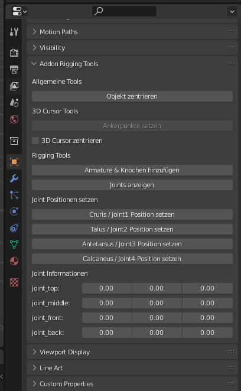
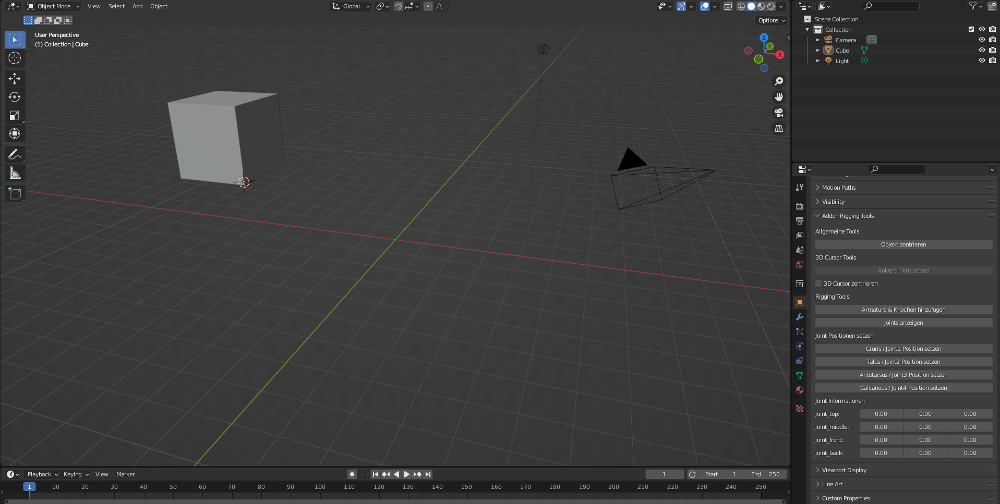
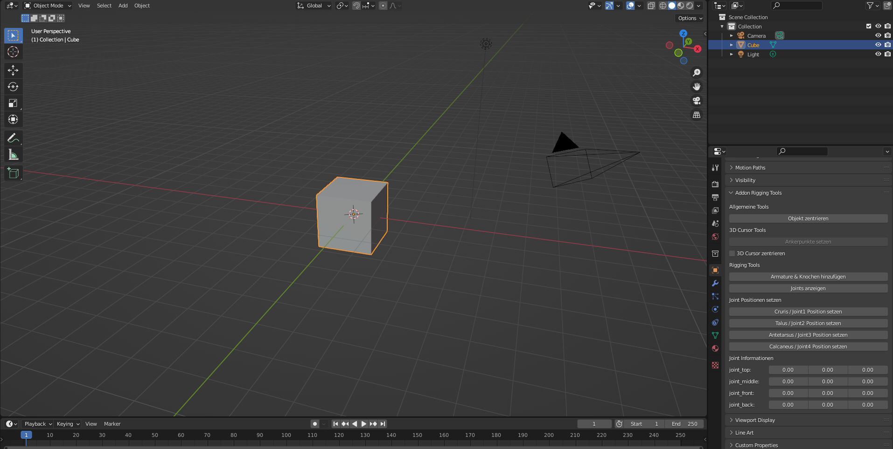
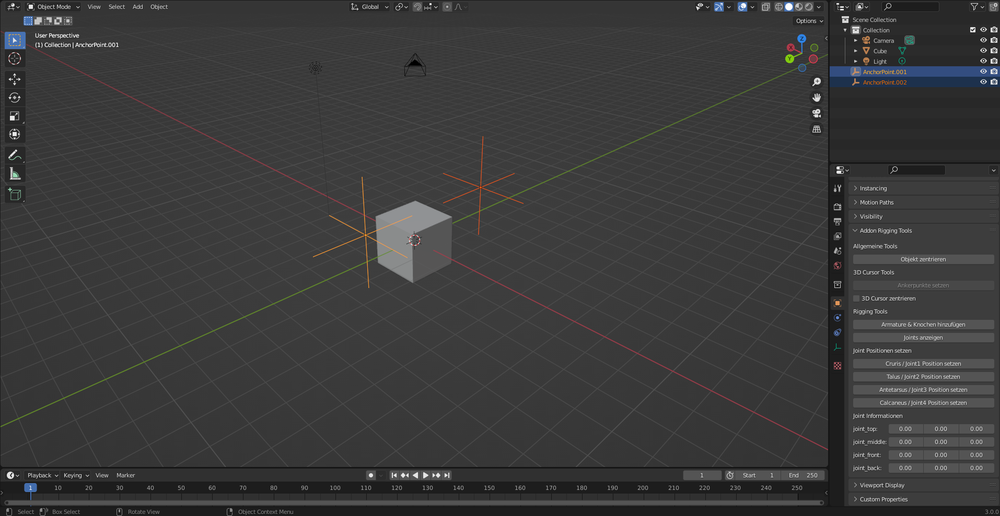
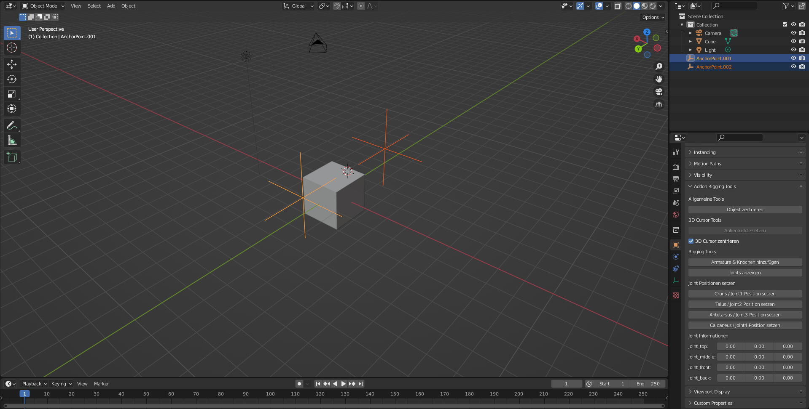
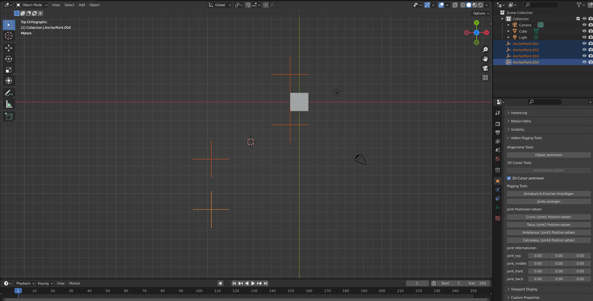
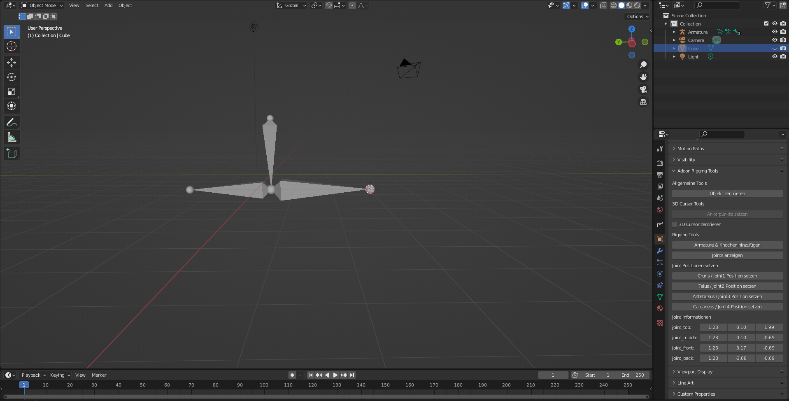
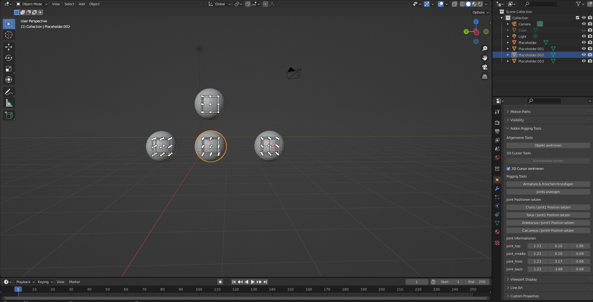

# Custom Blender Addon
## Blender 3.0 ist mindestens nötig um das Addon zu benutzen!
>Beschreibung: Ein Addon für Blender, welches das Riggen von Füßen erleichtern soll

 
Aufbau vom Addon:
 
Die Funktionen des Addons basieren auf einer "PropertyGroup" die man in Blender selbst nicht sehen kann.
Daher gibt es ein extra UI-Panel, welches alle wichtigen Informationen zu den Addon Daten und Funktionen beinhaltet.
Das Panel befindet sich jederzeit in der "Property"-Region vom Blender User-Interface.
  

##Funktionen vom Addon
- "Objekt zentrieren"-Funktion
  - Beschreibung:
    - Wenn ein Objekt aus der Szene ausgewählt ist, wird es an die Stelle (0, 0, 0) in der Szene gesetzt. Auch der Origin vom Objekt wird verändert!
        
      Vor dem zentrieren:
      
        
      Nach dem zentrieren:
      
    
- "Ankerpunkte setzen"-Funktion
  - Vorraussetzungen um Funktion zu benutzen:
    - mindestens 1 Objekt aus der Szene ist ausgewählt
    - asugewähltes Objekt ist im "Edit"-Mode
    - mindestens 1 Vertex ist ausgewählt
    
  - Beschreibung:
    - Wenn die Vorrausetzungen erfüllt sind, wird für jeden ausgewählten Vertex eine neues Objekt der Szene hinzugefügt.
      Diese neuen Objekte haben den Namen "Ankerpunkt". Die Objekte in der Szene an sich, haben keine Funktion,
      sie sind aber notwendig um die "3D Cursor zentrieren"-Funktion auszuführen.
      Sie können jederzeit manuell gelöscht werden, mit Hilfe dieser Funktion neu erstellt werden oder manuell neu erstellt werden.
      Das wichtige ist der Name bei den Objekten, d.h. solange sie "AnchorPoint" im Namen haben, erkennt das Addon sie als einen solchen an.
      
    2 Ankerpunkte in der Szene:
    
- "3D Cursor zentrieren"
  - Vorraussetzung:
    - es muss sich mindestens 1 "Ankerpunkt"-Objekt in der Szene befinden
  - Beschreibung:
    - Wenn dieses Feld aktiv ist, wird bei jedem Update des 3D-Viewport der 3D Cursor in die Mitte aller "Ankerpunkt"-Objekte gesetzt.
      
    Zentrierter 3D Cursor:
    
      
    Bsp mit 4 Objekten:
    
  
- "Armature & Knochen hinzufügen"-Funktion:
  - Beschreibung:
    - Wenn der Nutzer mit den 4 Punkten zufrieden ist und die Knochen zwischen den Punkten verbinden will, kann diese Funktion verwendet werden.
      Es werden alle 4 Punkte/Joints benutzt um 3 Knochen zu platzieren.
      
    Von der Funktion erstellte Knochen:
    
      
  - Anmerkung:
    - Verbindet nicht Mesh und Knochen miteinander, das muss noch manuell gemacht werden!
  
- -"Joints anzeigen"-Funktion:
    - Beschreibung:
       - Um die momentane Position der Punkte/Joints in der Szene zu sehen, kann diese Funktion benutzt werden.
       Sie erstellt in der Szene neue Objekte, die den Namen "Placeholder" haben und die aktuelle Position der Punkte/Joints besitzen.
       Zum aktualisieren der "Placeholder" kann diese Funktion einfach nochmal aufgerufen werden.
      
    Ansicht von Placeholdern und Gizmos:
    
    - Anmerkung:
      - Wenn man die Placeholder verschiebt verändert man nicht die Position der wirklichen Punkte/Joints
  
- "Joint setzen"-Funktion:
  - Bescchreibung:
    - Um die tatsächliche Postion von den Punkten/Joints für die Knochen zu verändern muss diese Funktion benutzt werden.
      Jeder Punkt hat eine eigene Funktion um das zu machen. Die Position die gespeichert wird, entspricht der aktuellen Position des 3D Cursor.
  - Anmerkung:
    - Um zu sehen welche die aktuelle Position ist, kann die "Joints anzeigen"-Funktion benutzt werden.
    Alternativ kann man den Vektor-Wert von den Positionen im "Joint Informationen" Teil vom dem Panel sehen. 
